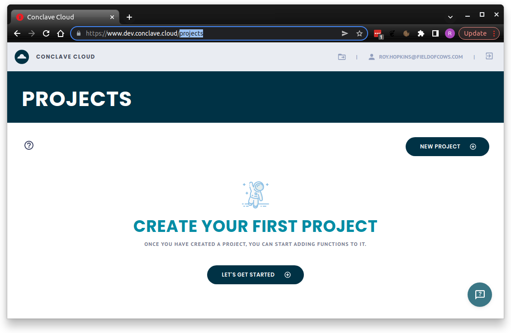

# Conclave Cloud Concepts

To get started with Conclave Cloud, you need to understand a few important concepts in the Conclave Cloud portal and 
the Command Line Interface (CLI). Let's start by defining those two:

## Conclave Cloud Portal

The [Conclave Cloud portal](https://www.conclave.cloud/) gives you the tools to manage your Conclave Cloud account 
and projects in a user-friendly, web-based interface.



When you first log in, you can see a list of existing projects and an option to create a new project. The definition 
of a project is given [below](#projects).

Within a project, you can check to see which functions you have deployed, how many times you have called them, and
lots of other information and metrics about the platform.

## Conclave Cloud Command Line Tool

The _Conclave Cloud Command Line Tool_ is known as `ccl` for short as this is the command you enter to invoke it in 
the terminal or command prompt.

You can download the tool [here](https://r3conclave.github.io/ccl-documentation/releases/).

The `ccl` tool provides all the management options available in the portal. It allows you to upload and invoke
functions without writing client code. This feature helps to test your functions or try out the Conclave Cloud platform.

Enter `ccl` in your terminal or command prompt to see available commands. There is help available for each 
command too. For example, you can enter the following command to get help for the `functions` command.

```
ccl functions --help
```

## Projects

A Conclave Cloud project is a specific configuration of the Conclave Cloud services. Currently, a project contains a 
particular set of uploaded functions and shows usage and log data for just those functions.

You can think of a project as an individual application or a service. For example, you may have a project for 
'Password Manager', or for a more extensive application, you may have projects named 'Project X Payment Processor' and 
'Project X User Data'.

When experimenting with the platform, create a project with a random name. You can always delete it when you're 
finished.

###  Project UID

When you first open a project in the portal, you will get a value called `Project UID`.

The project UID is the unique identifier for the current project.

__Note:__ Project names are also unique.

The project UID is not a confidential value.

## Functions

A Conclave function is a JavaScript code module that exports an entry point. The combination of this code plus the 
entry point name is uploaded and defines a single 'function' within the Conclave Functions service.

Each project will allow the configuration of a set of functions to invoke using the Conclave Functions service.

You can upload as many functions as you want, each designed to perform a different task.

You might find it more convenient to create an npm package and configure it using a tool such as webpack to assemble 
multiple files or even languages into a single JavaScript file for uploading to Conclave Functions. You can 
even define multiple exported functions from a JavaScript module, then upload the same file multiple times but 
change the entry point each time to create multiple functions. The Conclave Cloud Password Manager sample uses this 
approach. Take a look at the source code [here](https://github.com/R3Conclave/ccl-sample-conclavepass/tree/main/functions).

## Function hashes

Whenever you upload a function to Conclave Functions, `ccl` will calculate the [SHA256](https://www.simplilearn.com/tutorials/cyber-security-tutorial/sha-256-algorithm#what_is_the_sha256_algorithm)
hash of the JavaScript code with the entry point's name concatenated to the end. If the code or entry point changes, 
the hash also changes.

Whenever an end user wants to invoke a function, they specify the hash of the code and the function's entry point
that they expect to be processing their data. Once the Conclave Functions enclave receives the request, it checks
the expected hash against the actual hash as calculated inside the enclave and rejects the invocation request if 
they do not match. This verification ensures that the user fully controls what code can access their data.

The `ccl` tool will automatically use the previously calculated hash. This is not the most secure way to execute a 
function because if the hash changes, the `ccl` calculation will automatically update and call the function
anyway. To counter this, you can manually provide a hash via the command line.

When using Conclave Cloud's JavaScript or Java/Kotlin SDKs, you must provide the expected hash when invoking a function.
