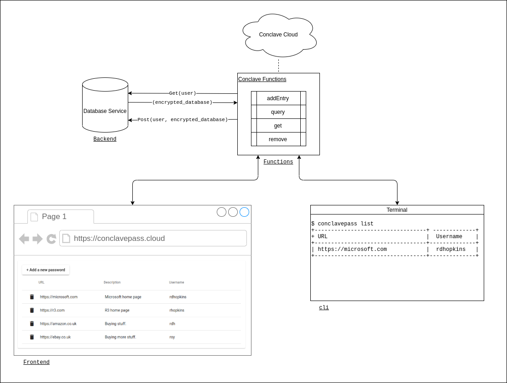

# Conclave Pass - Password Manager implemented using Conclave Cloud

Conclave Cloud provides a password manager as a sample application. You can get the application's code from 
[this GitHub repository](https://github.com/R3Conclave/ccl-sample-conclavepass). 

## Sample description

The Conclave Pass repository contains a set of projects that together implement a basic password manager service 
that demonstrates how to use Conclave Cloud services to provide a privacy-preserving backend to an application.

The end user can interact with the password manager service using both a web-based frontend implemented with Angular,
and a command-line tool written in Kotlin.

## How do existing password managers work?

Password managers maintain a database of password entries that are all protected by a single master password or 
access key. The password database contains sensitive information that the user wants to keep private. Even the 
password manager service administrators shouldn't be able to access entries within the database.

Password managers typically solve this privacy problem by storing the database using at-rest encryption in a 
cloud database. When users access the database on a new device, the application synchronizes a cloud copy of the 
entire database to the device. The user can then perform all database operations in the client application or the web 
browser.

For example, you can find the architecture used by LastPass [here](https://www.lastpass.com/security/zero-knowledge-security).

This approach is secure but has some limitations:

* If the database grows large, it may take significant network bandwidth/storage on the endpoint device.
* There is no opportunity for sharing or collaboration on database entries.

For password managers, these are not actual limitations, but this demo project shows that you can use Conclave Cloud 
to solve these two issues in other types of applications by accessing the database inside an SGX enclave on the cloud.

## What's the architecture of the ConclavePass app?

The following diagram illustrates the architecture of the ConclavePass application.



The components in the diagram are named corresponding to the Conclave Pass directory that contains its implementation.

These components are described below:

### Functions

The functions component consists of a typescript that provides methods that you can use to add, query, get, 
and remove entries within the user's database. This component requires access to the unencrypted database and therefore,
to ensure privacy, runtime encryption is used by hosting the functions within Conclave Cloud in the Conclave 
Functions service.

Conclave Functions are stateless and do not have access to any persistent storage. Therefore, external storage 
within the cloud is necessary to persist the user databases. The functions component uses the JavaScript
`fetch()` built-in capability to query and update an external data store with each user's encrypted database entries.
It is critical to encrypt any data exchanged via `fetch()` as the request comes from outside the Intel SGX enclave of 
Conclave Functions.

The Functions module uses another built-in function, `crypto.getProjectKey()` to get a key unique to the project and
function code and uses this key to encrypt/decrypt the user's database before exchanging it with external storage.

### Backend

The backend service is used to store and retrieve the encrypted database for each user. The encrypted data it 
handles can only be accessed within the functions component, ensuring that no unauthorized entity can access the 
user databases.

The simple implementation provided within this project consists of a Spring application that stores the databases in 
a key/value map in memory. All entries are lost if the service restarts.

### Frontend

The front end is a web application that allows login/logout and management of user keys. This web application 
implemented using the Angular framework demonstrates how you can interact with Conclave Functions using the Conclave 
Cloud JavaScript SDK.

### Command Line Interface (CLI)

The CLI is a terminal-based tool written in Kotlin that allows login/logout and management of user keys. This tool
demonstrates how you can interact with Conclave Functions using Conclave Cloud's Kotlin/Java SDKs.

## How is privacy preserved?

With the ConclavePass solution, the only component that can access the user databases in an unencrypted form is the 
function code that runs within the Conclave Functions service.

But how do we ensure that is the case?

Conclave Cloud ensures that only authorized function codes can access data. It does this by running the code within 
an Intel SGX enclave and providing an attestation to prove platform validity, code integrity, and code authenticity. 
The Conclave Cloud platform and the client SDKs handle the details of this whole process.

Let's look at how a user sends a password to the service. The front end or the CLI calls the `addEntry` function, 
passing the user's password and details of the new password entry. Conclave Cloud encrypts this information using a 
key that is only accessible to the set of functions that the user has approved to handle the user's database.


The Conclave Cloud client SDK obtains a public key from the platform signed by a report proving that the private key 
can only be accessed within an approved Conclave Functions enclave. The client SDK validates the report and ensures 
the key signature matches the report's signature. After validating the key, Conclave Cloud encrypts data using this key,
safe in the knowledge that only a valid Conclave Functions enclave can decrypt it.

The password entry is encrypted using this key and the `addEntry` function is invoked. The encrypted password is then 
picked up inside a Conclave Functions enclave which can decrypt the parameters using the private key that only it 
has access to. The function retrieves the encrypted user database from the external service.

Once the function has the user's encrypted database, it decrypts it. The key used to encrypt/decrypt the enclave is 
derived from many sources, all of which need to be present to obtain the correct key:

1. The project key - this is the same key that is used to decrypt the function code itself and the invocation 
   parameters that were provided to the function.
2. The hash of the code that is executing. Mixing this into the encryption key ensures that if the code is modified, 
   then it cannot access the database.
3. The user's password - It ensures that one user cannot access the database for another user.

The function decrypts the database, adds the new entry, re-encrypts it, and sends it back to the backend.

So, you can see that the only entity that has access to all the secrets required to access each user's database 
entry is a Conclave Function running the exact code that the user expects it to run, and when it has the user's 
password.

## Building and deploying the demonstration

You must host or build and deploy each of these components to run the demonstration.

### 1. Backend

The backend service needs to be available as a fixed IP on the internet to allow Conclave Functions to access it for 
storing user databases.

Conclave Cloud recommends setting up a new virtual machine with your cloud service provider to host this. You can 
choose a VM with the smallest size, as the resource requirements are less.

* Build the service using this command:

   ```
   ./gradlew build
   ```

* Deploy the `build/libs/conclavepass-0.0.1-SNAPSHOT.jar ` file to your VM.

* Run the backend service with this command:

   ```
   java -jar ./conclavepass-0.0.1-SNAPSHOT.jar 
   ```

### 2. Functions

* Note down the IP address for the backend service that you have just deployed, and update the functions module to 
connect to the service with that address in `functions/src/index.ts`.

* Follow the instructions in [functions/README.md](https://github.com/R3Conclave/ccl-sample-conclavepass/blob/main/functions/README.md)
to set up a Conclave Cloud project and build and deploy the functions ready for use.

### 3. Frontend

* Download and unzip the Conclave Cloud JavaScript client SDK and update the frontend project to use your local 
copy.

* Build and run the front end.

You can find detailed instructions [here](https://github.com/R3Conclave/ccl-sample-conclavepass/blob/main/frontend/README.md).

Once the front end is running, you can access it at http://localhost:4200.

### 4. CLI

* Download and unzip the Conclave Cloud Java client SDK and update the CLI project to use your local copy.

* Build and run the CLI.

You can find detailed instructions [here](https://github.com/R3Conclave/ccl-sample-conclavepass/blob/main/cli/README.md).

## Usage notes

This sample is only a demo of a password manager application. It provides only basic functionality and error 
handling. There are a few things to note when you try the demo.

### The username is used as the user token

When you enter your username, Conclave Cloud runs it through a [SHA256](https://www.simplilearn.com/tutorials/cyber-security-tutorial/sha-256-algorithm#what_is_the_sha256_algorithm)
hashing algorithm and converts it to a hex string. This hex string is used as the token for the user. The
backend service stores and retrieves encrypted databases using this token.

### The password is fixed on the first access

The first time a user token is used, there is no entry within the backend service. So, it returns an empty string. The 
functions component assumes this is a new user and creates an empty database encrypted with the current password. All
subsequent access must use the same password. So the user cannot change the password later.

### Incorrect passwords are not handled well

If you enter an incorrect password, the decrypt function returns invalid data within the functions component. The sample
app doesn't handle this invalid data well, and the JavaScript code fails. This behavior serves the purpose of protecting
the database but is not a good user experience. This is something that can be improved in the demonstration code.

### The database is not persisted

As mentioned above, restarting the backend service clears all user data. This behavior is useful for demonstration 
purposes. However, you should not use this sample application for real-world password management because of the risk of 
data loss.
