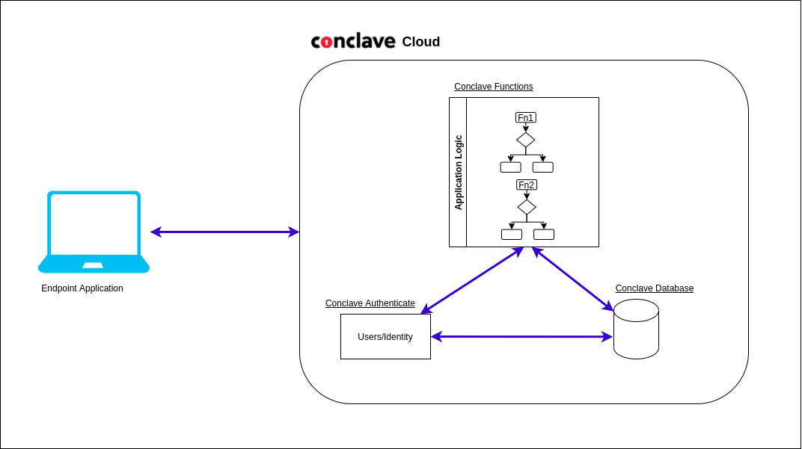

# What is Conclave Cloud?

Conclave Cloud is a platform for hosting privacy-preserving applications. It's built on top of the [Conclave SDK](https://github.com/R3Conclave/conclave-core-sdk), 
which is based on Intel Software Guard Extensions ([Intel SGX](https://www.intel.com/content/www/us/en/developer/tools/software-guard-extensions/overview.html)).
The Conclave Cloud platform provides all the tools necessary to ensure that only authorized parties gain access to data.

## Conclave Functions

The current platform delivers our first service, Conclave Functions, which is a serverless execution environment, 
much like AWS Lambda or Azure Cloud Functions.

_Conclave Functions_ differs from similar services by using end-to-end encryption between the end-user and the
container that runs the function. Conclave Cloud provides this data-in-use encryption using a secure Conclave 
_enclave_ to run the code. Along with protecting the integrity and privacy of the user's data, enclaves provide 
hardware-backed assurances over the exact code that processes the data.

You can deploy and host your code to the Conclave Cloud platform with Conclave Functions. You can call your
functions once a year, once an hour, or thousands of times an hour. The platform will cope with the demand and scale
accordingly with no management or intervention from you.

## What can you do with Conclave Cloud/Functions?

Conclave Functions allows you to write code that will run inside an enclave with _absolutely no boilerplate_. This 
means that you can focus on business logic without worrying about how to transfer data to and from the enclave, 
how to encrypt data, or how to ensure platform integrity.

You can provide cryptographic evidence to your users that the code you claim to process their data is actually the
code that processes them. You can also prove that as a service host or author, you do not have access to the
keys that encrypt the user's data. In fact, you can prove that _nobody except the Conclave Functions enclave
can access the data_, including R3 and Azure: our cloud service provider.

One thing to remember is that Conclave Functions are stateless. Every time you invoke your function in the Conclave 
Functions service, any previous state is likely to be lost. There is a chance that the previous state is available 
in memory, but you cannot rely on it - the best you can do is use any previous state as a cache that can be used if 
present.

Stateless functions have limited use. Conclave Functions provides an alternative to storing state directly. It 
supports a subset of the JavaScript `fetch()` API, allowing outgoing calls to external services. 
This means that a function can retrieve and set data using an external service. You must ensure that private data is 
not leaked by the external call, as the actual call takes place outside the enclave.

## What problems can you solve with Conclave Functions?

You can use Conclave Functions to provide solutions or enhance the privacy for different types of applications, 
including:

* Pure data protection products such as cloud-based file storage with secure file sharing.
* Zero-knowledge proof applications, such as proving identity or age, without providing the actual data to the 
  verifying party.
* Multiparty computation, where data is collated from multiple parties and derived into a combined result without 
  divulging the shared data with any other party or service.
* Private set intersection applications, such as allowing different institutions to find common data between their 
  private datasets and the data of other parties.

Conclave Cloud provides a sample showing how to implement a password manager using Conclave Functions, a web-based 
frontend, a Kotlin-based CLI tool, and a Spring backend for persistence. You can find the sample in
[this GitHub repository](https://github.com/R3Conclave/ccl-sample-conclavepass).

## Future plans of the Conclave Cloud platform

The Conclave Cloud platform will bring together an expanding set of services that seamlessly integrate with each 
other, providing a rich set of tools for implementing solutions without ever having to leave the Conclave Cloud 
platform.

You can let us know which services we should prioritize through this [feedback form](https://r3corda.typeform.com/to/SQoseSTK#source=conclaveCloud).